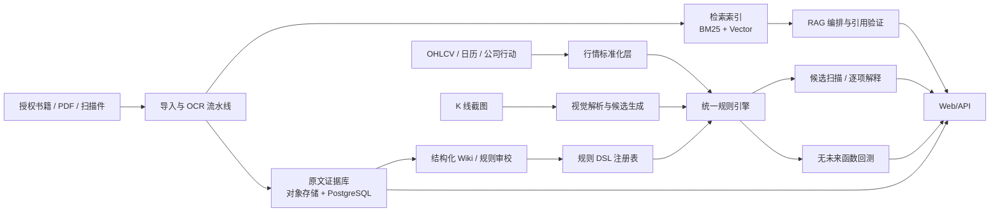

# MASTER PLAN：技术分析 Wiki、证据库、RAG、形态识别与回测平台

> 历史基线 v1：保留用于追溯。当前实施真相已迁移至 `MASTER_IMPLEMENTATION_PLAN.md`；差异与兼容策略见 `MIGRATION_FROM_CURRENT_PLAN.md`。

## 1. 项目一句话

建立一个“可追溯、可解释、可验证”的技术分析知识与研究平台：把合法持有的技术分析资料蒸馏为结构化规则与 Wiki，以原文版面作为证据；把相同规则应用于文本问答、K 线截图、OHLCV 扫描和历史回测，并明确展示不确定性和限制。

本产品是研究与教育工具，不提供个性化投资建议，不承诺盈利，不自动替用户进行实盘交易。

## 2. 目标用户与核心工作流

### 2.1 用户

- 学习者：查概念、看原文证据、比较相似形态。
- 研究员：将自然语言定义转成可执行规则，扫描标的并回测。
- 内容编辑/审校员：导入书籍、校正 OCR、建立引用与 Wiki 条目。
- 管理员：管理授权、数据源、模型版本、审计与访问权限。

### 2.2 四条端到端工作流

1. **资料入库**：上传文件 → 病毒与权限检查 → 页面渲染 → OCR/版面识别 → 页码映射 → 分块 → 人工审校 → 索引。
2. **知识问答**：提出问题 → 查询理解 → BM25 + 向量 + 元数据混合检索 → 重排 → 基于证据回答 → 逐条引用 → 无证据时拒答或提示不足。
3. **图表分析**：上传 K 线截图或选择行情区间 → 解析上下文/坐标/蜡烛 → 生成候选 → 使用统一规则引擎验证 → 返回匹配、置信度、规则逐项解释及风险提示。
4. **规则验证**：选择已版本化规则 → 指定市场、周期、样本和成本 → 生成不可变回测清单 → 时间因果审计 → 执行 → 报告指标、交易明细、偏差与可复现信息。

## 3. 产品成功标准

MVP 成功不是“能聊天”，而是以下闭环成立：

- 一份 200–400 页样例书可稳定导入，至少 98% 页面具备可靠的物理页映射；抽样 OCR 字符准确率达到既定门槛。
- Wiki 条目能回到对应证据片段与页面图像，引用定位可复核。
- 基准问题集上的引用准确率、引用覆盖率、可回答性判断达到门禁。
- 至少 8 种蜡烛/组合形态由 DSL 表达，并在扫描、解释和回测三个入口得到一致结果。
- OHLCV 回测通过未来函数测试、时间边界测试和可重复性测试。
- 截图识别在“平台生成的标准化图像”上完成受限 MVP；真实世界截图低置信度时必须降级或要求用户补充上下文。

具体指标见 [10_TEST_EVAL_ACCEPTANCE.md](10_TEST_EVAL_ACCEPTANCE.md)。

## 4. 范围分层

### 4.1 MVP（建议 10–14 周，6–9 个角色可并行）

- PDF/扫描 PDF 导入；OCR；物理页、PDF 页、印刷页映射。
- 证据片段、Wiki 条目、规则、引用、审校状态的版本化数据模型。
- 中文优先的 BM25 + 向量 + 元数据过滤 + Cross-Encoder/LLM 重排。
- 带逐条引用、拒答和证据查看器的 RAG。
- CSV/Parquet OHLCV 导入；一个经授权的数据供应商适配器。
- 规则 DSL v1；8–12 个明确可计算的形态；统一规则引擎。
- 横截面候选扫描与历史回测；手续费、滑点、公司行动基础处理。
- 标准图像截图识别：已知主题、已知周期、可推断坐标；人工确认。
- Web 前端：知识库、问答、证据查看、规则详情、扫描、截图、回测。
- 单租户部署、RBAC 基础版、审计日志、备份恢复。

### 4.2 V1

- 多书交叉引用与版本差异；知识冲突视图。
- 更多市场/数据商；交易日历、复权策略和点时成分股。
- 真实截图域增强、图像质量评分、坐标校准向导。
- 组合条件、上下文趋势、成交量确认、风险/退出 DSL。
- 事件驱动回测、组合级约束、Walk-forward 和参数稳定性分析。
- 多租户、配额、异步任务优先级和成本控制。

### 4.3 V2/研究方向

- 图文多模态检索；书中示意图的结构化解析。
- 学习型候选生成器，但规则引擎仍作为可解释验证层。
- 主动学习与审校优先队列。
- 模拟盘/告警；实盘接入必须另立安全、合规和风控项目。

### 4.4 非目标

- 不承诺识别任意截图；不把截图像素反推价格当作交易级数据。
- 不根据回测自动宣称策略有效；不以单一收益率作为验收标准。
- 不储存或公开传播超出授权范围的书籍全文。
- MVP 不做实盘下单、不做高频/逐笔撮合、不做任意自然语言自动生成并直接上线的策略。

## 5. 总体架构

### 5.1 建议技术栈

| 层 | MVP 建议 | 说明 |
|---|---|---|
| Web | Next.js + TypeScript + Tailwind + ECharts/Lightweight Charts | SSR 管理页与交互图表 |
| API | Python 3.12 + FastAPI + Pydantic v2 | 数据、ML、回测生态统一 |
| 异步任务 | Celery + Redis；或已有云队列 | OCR、嵌入、扫描、回测 |
| 事务数据 | PostgreSQL 16 | 版本、权限、引用、任务状态 |
| 向量 | pgvector 起步 | 降低运维复杂度；规模增长后再拆 |
| 全文检索 | OpenSearch | BM25、中文分析器、过滤、聚合 |
| 对象存储 | S3 兼容存储（MinIO/云 S3） | 原文件、页面图、回测产物 |
| OCR/版面 | PyMuPDF + OCRmyPDF/Tesseract/PaddleOCR，可插拔云 OCR | 保留多引擎与人工校正能力 |
| 数据计算 | Polars + PyArrow + NumPy | 列式 OHLCV 与特征 |
| 回测 | 自研最小事件/向量混合内核；参考成熟库做对照 | 时间语义完全受控 |
| 视觉 | OpenCV + 可选检测/分割模型 | 先几何/颜色方案，后学习模型 |
| 可观测性 | OpenTelemetry + Prometheus + Grafana + Sentry | trace_id 贯穿任务 |
| 部署 | Docker Compose（开发）+ Kubernetes/托管容器（生产） | IaC 与迁移可重复 |

技术栈不是合同；替换时必须保持 API、数据语义、时间语义和验收指标，并记录 ADR。

## 6. 核心数据与一致性约束

### 6.1 核心实体

`SourceAsset → SourceEdition → SourcePage → PageRegion → EvidenceSpan → WikiEntry/RuleDefinition → Citation`

行情链：

`Instrument → TradingCalendar → OHLCVBar/CorporateAction → DatasetSnapshot → FeatureSet → SignalEvent → BacktestRun`

视觉链：

`ChartUpload → ChartParse → VisualCandle → VisualCandidate → RuleEvaluation`

### 6.2 全局不变量

- 原始文件只增不改，以 SHA-256 标识；派生物记录生成器、配置和父对象。
- 物理页号、PDF 页索引、印刷页码分字段保存，禁止用一个 `page` 混用。
- 证据引用固定到不可变 evidence revision；Wiki 新版本不能悄悄移动旧引用。
- 所有时间戳存 UTC，并保存市场时区；交易日由日历服务决定。
- `available_at` 决定数据何时可被策略看见，不能仅依赖 bar 的 `timestamp`。
- 规则、数据快照、特征代码、执行器、参数和成本模型共同决定回测身份。
- 每个 AI 生成的 Wiki/规则内容默认 `draft`，未经审校不得标记 `verified`。

## 7. 实施工作流与关键依赖

| 工作流 | 主要产物 | 前置 | 可并行项 |
|---|---|---|---|
| WF-0 基线与治理 | monorepo、CI、ADR、环境、权限模型 | 无 | 产品、Schema 设计 |
| WF-1 证据导入 | 页面、OCR、映射、证据片段 | WF-0 | 数据模型、前端原型 |
| WF-2 Wiki/RAG | Wiki、索引、检索、引用回答 | WF-1 样例数据 | 行情层 |
| WF-3 行情与规则 | 标准 OHLCV、DSL、引擎、扫描 | WF-0 | WF-1/2 |
| WF-4 回测 | 回测清单、执行器、报告、因果测试 | WF-3 | 前端 |
| WF-5 视觉 | 标准截图解析、候选、规则验证 | DSL 语义稳定 | 回测 |
| WF-6 产品集成 | API、前端、异步任务、审计 | 各域 API 稳定 | 测试资产 |
| WF-7 硬化与发布 | 评测、性能、安全、版权、恢复演练 | 全部 | 文档和培训 |

关键路径：`WF-0 → WF-1 → WF-2 → WF-6 → WF-7` 与 `WF-0 → WF-3 → WF-4 → WF-6 → WF-7`。视觉不是首个知识闭环的阻塞项，但必须在 MVP 发布前达到受限场景门禁。

## 8. 阶段与退出条件

### M0：契约冻结（第 1–2 周）

- 冻结术语表、ID 规范、时间语义、页码语义、API 错误格式。
- 建立仓库、CI、迁移、测试骨架、开发环境。
- 选定一份合法样例书与一个 OHLCV 样例集。
- 退出：架构 ADR 通过；黄金样本和验收指标有负责人。

### M1：证据闭环（第 3–5 周）

- 上传到页面图、OCR、页码映射、证据片段、证据查看器闭环。
- 退出：抽样页映射、OCR、坐标定位达到指标；原文件可追溯。

### M2：知识闭环（第 5–7 周）

- Wiki schema、审校流、混合检索、重排、带引用问答完成。
- 退出：RAG 黄金集通过；无证据拒答通过；版权策略生效。

### M3：规则与行情闭环（第 4–8 周）

- 标准 OHLCV、DSL、编译器、统一引擎、8–12 种规则、候选扫描完成。
- 退出：规则金样、扫描/解释一致性、数据质量门禁通过。

### M4：回测与视觉闭环（第 8–11 周）

- 回测、成本、报告、未来函数测试；标准截图识别与人工确认。
- 退出：因果审计全部通过；标准图像评测通过；低置信度可安全降级。

### M5：集成与发布（第 11–14 周）

- 前端整合、RBAC、审计、监控、备份恢复、压测、安全和版权审查。
- 退出：`10_TEST_EVAL_ACCEPTANCE.md` 中所有 P0 门禁通过，没有未接受的 Sev-1/Sev-2 风险。

## 9. 多 AI 实施模型

建议设 1 个 Integrator/Tech Lead，另设产品/知识、证据导入、检索、行情/规则、回测、视觉、全栈、QA/SecOps 等角色。代理间通过版本化契约与固定交接包协作，不通过口头上下文“猜”。

每项任务最少包含：

- 输入版本与允许修改路径；
- 明确输出文件、迁移、接口和测试；
- 非目标与不得破坏的不变量；
- 可自动运行的验证命令和期望结果；
- 已知风险、遗留项和回滚方式；
- commit/变更集标识以及 DoD 自检。

完整职责矩阵和交接格式见 [11_MULTI_AI_EXECUTION.md](11_MULTI_AI_EXECUTION.md)。

## 10. MVP 任务优先级

- **P0**：证据链、页码映射、数据时间语义、统一 DSL、未来函数防护、引用校验、授权与访问控制、可重复构建。
- **P1**：检索质量、Wiki 审校体验、扫描性能、回测报告、标准截图识别、成本与可观测性。
- **P2**：真实截图泛化、多数据商、组合回测、多书冲突分析、主动学习。
- **P3**：自然语言生成 DSL、模拟盘、复杂多模态理解；需单独安全评审。

## 11. 关键风险与提前决策

| 风险 | 早期信号 | 对策 |
|---|---|---|
| OCR/页码错位污染引用 | 引用页面肉眼对不上 | 三重页码、锚点抽检、不可变证据 revision |
| 书中定义含主观语义 | 规则实现间结果不一致 | 把“语义解释”与“可计算近似”并列保存 |
| 回测未来函数 | 异常完美收益、边界变动敏感 | `available_at`、延迟执行、点时数据、泄漏单测 |
| 截图缺少坐标/周期 | 像素可拟合但价格不可恢复 | 质量门控、上下文询问、只给相对形态结论 |
| RAG 引用貌似相关但不支撑 | 引用命中关键词但不蕴含结论 | claim-citation 验证器、句级证据、拒答 |
| 版权超范围使用 | 全文可被连续导出 | 权限、短片段、速率/窗口限制、审计、删除流程 |
| 规则漂移 | 扫描和回测同名异义 | 规则版本固定、编译产物校验和、不可变 run manifest |
| 多 AI 冲突 | 并行修改同一迁移/契约 | 路径所有权、契约优先、短分支、Integrator 合并 |

## 12. 最终交付物

- 可运行的 monorepo、开发与生产部署清单。
- 数据库迁移、OpenAPI、事件 Schema、DSL JSON Schema。
- 样例书导入清单、黄金页面、OCR/页码评测报告。
- Wiki、证据查看器、RAG 评测集与报告。
- 行情数据卡、规则库、扫描与视觉评测报告。
- 回测清单、因果审计报告、可复现实验产物。
- 威胁模型、版权处理记录、SBOM、备份恢复记录。
- 用户手册、管理员手册、运维手册和已知限制。

详细的完成定义与验收方式以各专题文档为准；若专题文档与本文件冲突，优先遵循更严格的安全、版权和时间因果要求，并由 Tech Lead 记录 ADR。
