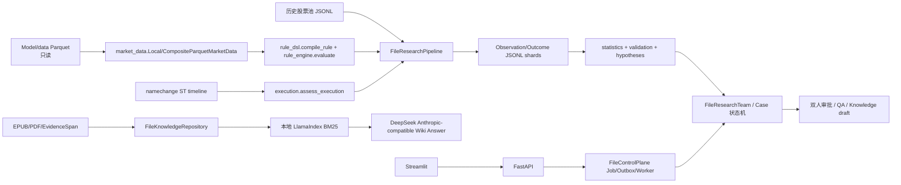

# 02 · 当前系统架构

## 定位

当前实现是单机、文件型、受审批约束的 A 股**研究与证据平台**。它不连接券商、不自动下单；也没有一个已通过最终锁箱、可发布的策略。核心闭环由 `README.md` 定义为：

```text
Parquet/股票池/书籍
  → Observation（规则在 T 收盘匹配）
  → Outcome（T+1 开盘进入、固定期限退出）
  → 统计/FDR/样本外报告
  → 假设草稿/QA
  → 人工双审批
  → 知识卡审校/BM25/Wiki Answer
```

## 运行组件与调用关系



### 主要模块证据

| 层 | 实现 | 作用 |
|---|---|---|
| API/UI | `apps/api/main.py`，`apps/research_ui/app.py` | API Key/RBAC、Case/Job/审批/知识 API；Streamlit 内部研究台。 |
| 控制面 | `packages/orchestration/file_runtime.py`、`worker.py` | JSON Job、事件、Outbox、dead-letter、租约、取消、幂等。 |
| Case 治理 | `packages/orchestration/state_machine.py`，`packages/agents/team.py` | 固定状态转换，九角色产生审计条目；审批不能由 LLM 绕过。 |
| 市场数据 | `packages/market_data/*` | 只读 Parquet、Tushare 缓存/overlay、PIT manifest、ST timeline、强数据快照。 |
| 规则/研究 | `packages/rule_dsl/*`，`packages/rule_engine/engine.py`，`packages/research/*` | 规则 DSL、事件结果、搜索、候选比较、FDR、Campaign。 |
| 回测复核 | `packages/backtest/engine.py`，`packages/research/vectorbt_adapter.py`，`backtrader_adapter.py` | 三种不同成熟度的研究核算路径。 |
| 证据/AI | `packages/evidence/*`、`packages/knowledge/*` | EPUB/PDF 证据、知识卡、BM25、受证据约束的问答。 |

## 每日/批处理运行流程

1. `scripts/sync_tushare_incremental.py` 或 `packages.orchestration.prefect_flows.daily_operations_flow` 拉取日线增量到 `tushare_incremental_cache`，不覆盖原始 `trend_cache`。
2. `CompositeParquetMarketData` 按 `trend_cache → tushare_daily_cache → tushare_incremental_cache` 读取；overlay 同 symbol 时后者覆盖重复日期（`packages/market_data/composite_parquet.py`）。
3. 数据质量、主板范围、交易性、PIT 工作通过 `scripts/run_gen3_*.py` 产生独立工件；这些脚本不会自动触发策略交易。
4. 操作员经 API 创建白名单 Job；`FileControlPlane` 写入 `data/control`，Worker/Prefect 调用对应脚本（`packages/orchestration/file_runtime.py`、`prefect_flows.py`）。
5. 已冻结 Campaign 才可由 `FileResearchTeam.run()` 执行：验证代码快照、强数据快照、协议、时间边界后，运行 `FileResearchPipeline`。
6. 输出为 Observation/Outcome 分片、统计、walk-forward、假设草稿、QA、报告和 Case 状态。成功并不自动发布；仍需 Hypothesis、Rule、Knowledge 三层人工审批。

## 最终输出

- 研究输出：`data/research_cases*/<case>/research_run/` 的 JSON/JSONL 分片、`report.md`、`statistics_out_of_sample.json`、`qa_review.json`。
- 策略搜索输出：`data/rule_search/`、`data/auto_discovery/`、`data/candidate_comparisons/`。
- 知识输出：`data/knowledge/{drafts,published,rejected,reviews}` 的知识卡；Wiki Answer 为 API 响应，不是交易信号。
- 不存在的输出：实时荐股、券商订单、持仓、账户权益、自动调仓、生产化策略发布。
